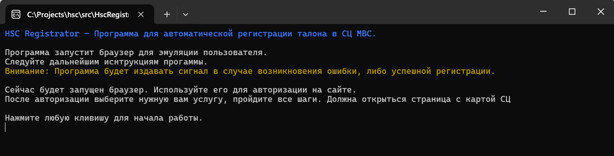

# Hsc Registrator
## Руководство пользователя

### Установка

1. Скачать и установить [Microsoft .NET 8](https://dotnet.microsoft.com/en-us/download/dotnet/thank-you/runtime-desktop-8.0.7-windows-x64-installer)
2. Скачать архив [HscRegistrator.zip](https://github.com/thor836/HscRegistratorApp/releases) и распаковать;
3. Запустить файл из папки с программой: <code>install.cmd</code>;
*(Эта команда выполняется только один раз за все время пользования программой. Данная команда установит специальный браузер, для интеграции с кодом программы)*.

### Запуск программы

1. Запустить файл: <code>HscRegistrator.exe</code>;
2. Следовать дальнейшим инструкциям программы.

#### Использование

1. В открывшемся браузере залогиньтесь на портале;
2. Выберите услугу: "Практичний іспит";
3. Пройдите все последующие шаги до страницы с картой сервисных центров МВС;
4. Вернитесь в окно программы, для выполнения дальнейших инструкций;
5. Укажите дату начала сканирования в формате ДД.ММ.ГГГГ и нажмите клавишу Enter;
6. Укажите дату окончания сканирования в формате ДД.ММ.ГГГГ и нажмите клавишу Enter;
7. Укажите номер СЦ МВС и нажмите клавишу Enter (чтобы узнать номер СЦ, на карте можете открыть нужный для вас СЦ, в заголовке окна будет указан номер);
8. После указания всех данных из пп.5, программа автоматически начинает сканирование.

Не нужно закрывать окно браузера или окно программы, пока она работает!

телеграм: <code>@nbd08</code>
