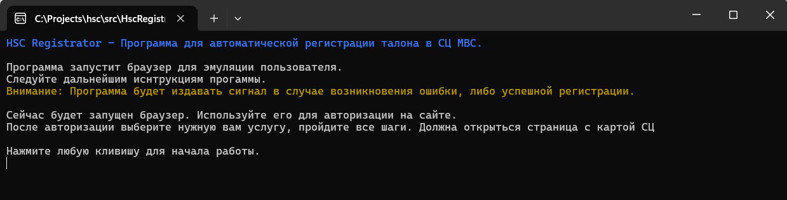
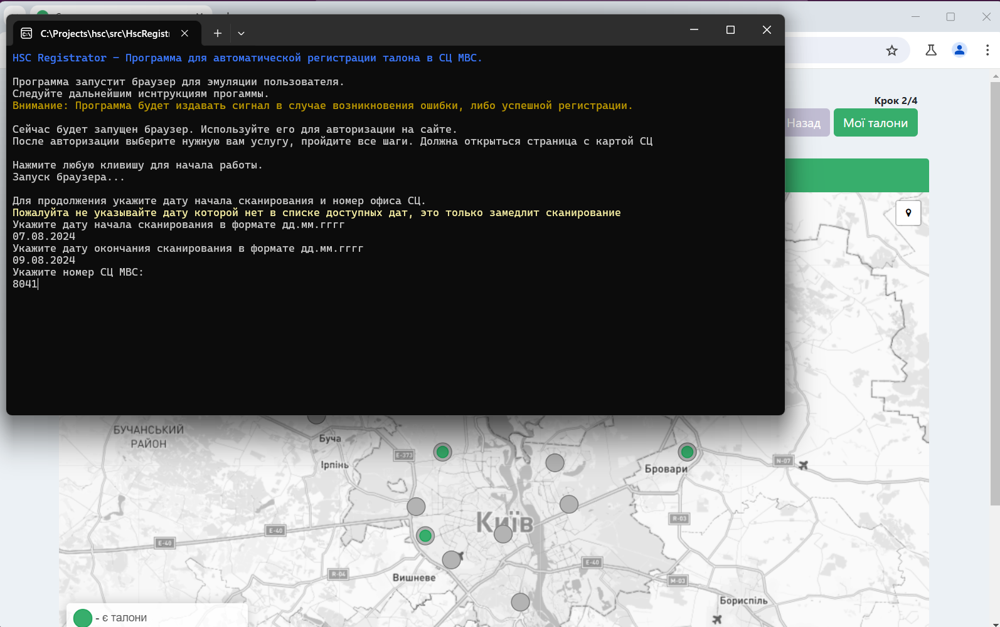
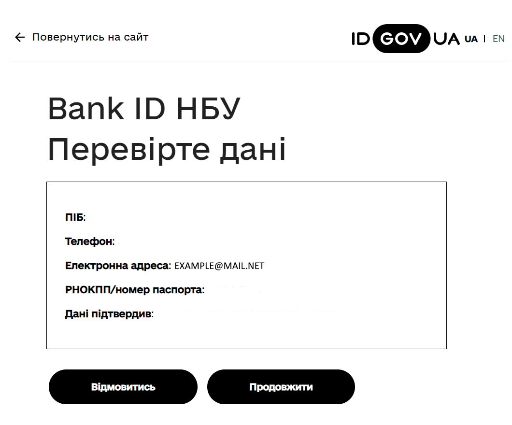
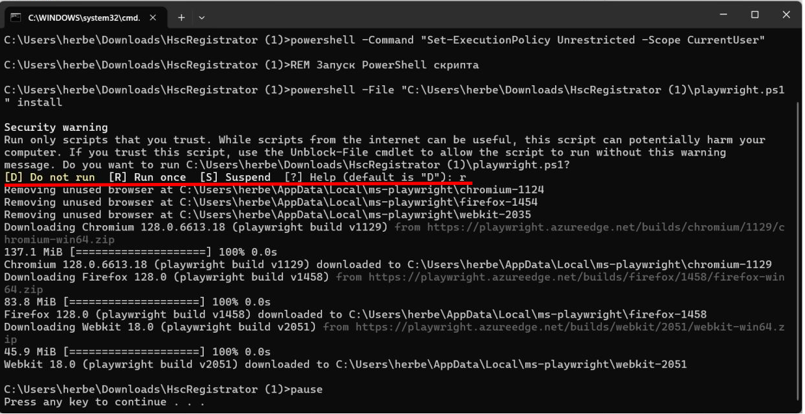
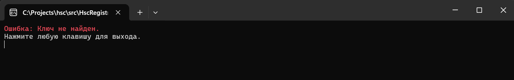
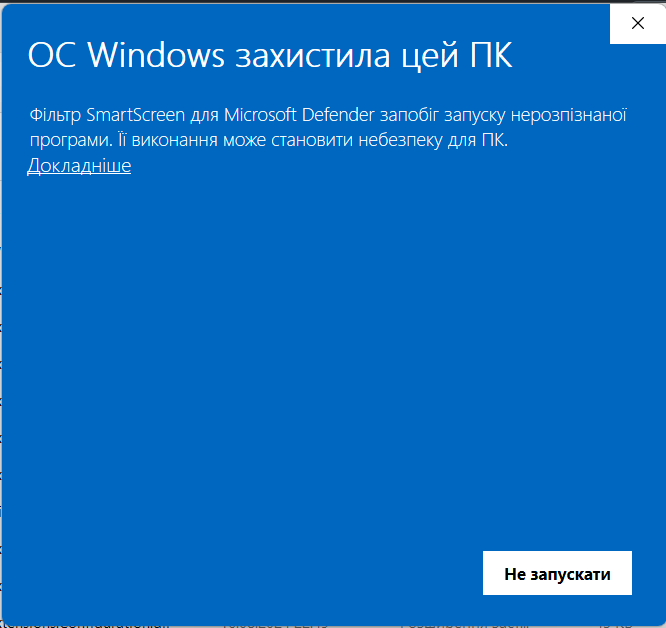
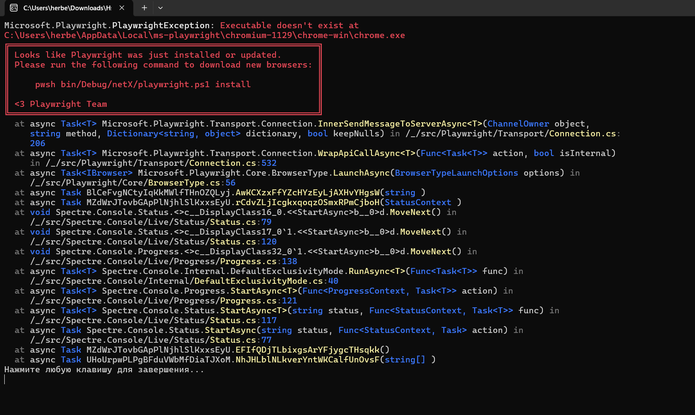

# Hsc Registrator v1.6
## Руководство пользователя

### Описание работы программы
После запуска программа откроет браузер, в котором пользователь авторизуется на сайте и выбирает необходимую услугу. Затем программа запросит период сканирования и номер СЦ. После этого начнется сканирование указанного диапазона дат. Как только появляется свободный талон, программа автоматически зарегистрирует его. Талон будет зарегистрирован на первую доступную дату из указанного диапазона, а время будет выбрано самое раннее.

[Демонстрация работы](https://drive.google.com/file/d/156A9jxGFJBSYcUNO6NYLbXoSq48yEVPE/view?usp=drive_link)

### Вопросы и ответы
1. Как работает программа?\
   Читайте раздел Описание работы программы. Если коротко, то программа просто эмулирует действия пользователя, но с более высокой скоростью.
2. Собирает ли программа личные или банковские данные пользователя?\
   Нет, программа не собирает и не отправляет личные или банковские данные.
3. С какими личными данными работает программа и для каких целей?\
   Программа работает только с email пользователя, который используется для регистрации талона. Email не сохраняется в программе.
4. Зачем нужно запускать команду install.cmd на этапе установки программы?\
   Это исполняемый скрипт, который скачивает специальный браузер, необходимый для работы программы.
5. Зачем нужен специальный браузер? Почему нельзя использовать уже имеющийся в системе?\
   Специальный браузер необходим для корректной работы программы, так как он обеспечивает доступ к определенным данным сессии пользователя после авторизации, которые используются в дальнейшей работе программы. Другие браузеры не позволяют это сделать.
6. Программа работает уже долго, но талон так и не появился. Что делать?\
   Если новые талоны не появляются, программа не сможет их зарегистрировать. Это не зависит от программы, так как талоны появляются в случайном порядке. Иногда на это требуется несколько дней, а иногда всего пару часов.

### Установка
Рекомендуемая ОС Windows 10 и выше.

1. Скачать и установить [Microsoft .NET 8](https://dotnet.microsoft.com/en-us/download/dotnet/thank-you/runtime-desktop-8.0.7-windows-x64-installer)
2. Скачать архив [HscRegistrator.zip](https://github.com/thor836/HscRegistratorApp/releases) и распаковать;
3. Запустить файл из папки с программой: <code>install.cmd</code>;
*(Эта команда выполняется только один раз за все время пользования программой. Данная команда установит специальный браузер, для интеграции с кодом программы)*;
4. Положить файл <code>license.key</code> в папку с программой *(этот файл предоставляется разработчиком отдельно)*;
5. Запустить файл: <code>HscRegistrator.exe</code> и следовать инструкциям программы.

Для Windows 7/8, на этапе установки программы, могут возникнуть ошибки, скорее всего придется произвести дополнительные настройки.\
Для MacOS, можно попробовать запустить Windows 10 на виртуальной машине. Для этого нужно будет установить саму виртуальную машину.

### Запуск программы

1. Запустить файл: <code>HscRegistrator.exe</code>;
2. Следовать дальнейшим инструкциям программы.

### Использование

1. В открывшемся браузере залогиньтесь на портале;
2. Выберите услугу: "Практичний іспит";
3. Пройдите все последующие шаги до страницы с картой сервисных центров МВС;
4. Вернитесь в окно программы, для выполнения дальнейших инструкций;
5. Укажите дату начала сканирования в формате ДД.ММ.ГГГГ и нажмите клавишу Enter;
6. Укажите дату окончания сканирования в формате ДД.ММ.ГГГГ и нажмите клавишу Enter;
7. Укажите номер СЦ МВС и нажмите клавишу Enter (чтобы узнать номер СЦ, на карте можете открыть нужный для вас СЦ, в заголовке окна будет указан номер);
8. После указания всех данных из пп.5, программа автоматически начинает сканирование.

Не нужно закрывать окно браузера или окно программы, пока она работает!

### Обязательные условия

1.	В системный параметрах, нужно отключить переход компьютера в спящий режим *(в противном случае, через некоторое время, компьютер перейдет в спящий режим и программа прекратит свою работу)*.
    a.	Откройте «Параметры» через меню Пуск или нажав клавиши Win+I на клавиатуре.
    b.	Перейдите в раздел Система — Питание и батарея. 
    c.	В подразделе «Питание» будет присутствовать пункт «Экран и спящий режим», где вы можете отключить его.

2. Ваш email должен быть привязан к банку через который вы осуществляете вход на сайт. Во время входа в портал, а именно на странице подтверждения входа (там где указаны: имя, ИНН, e-mail и телефон), убедитесь, что указан ваш e-mail *(в противном случае программа не будет работать должным образом)*.

### Ошибки и их решения
1. Предупреждение о безопастности / Security warning

**Описание**: При установке программы, во время выполнения команды *install.cmd*, Windows может выдать предупреждение о безопасности.

**Решение**: Нажмите клавишу "R" и Enter для продолжения процесса установки. После завершения установки будет выведена фраза "Press any key to continue...", окно можно закрывать.

2. Ключ не найден

**Описание**: Ваш ключ уже не актуален, либо он отсутствует.

**Решение**: Обратитесь к разработчику.

3. Предупреждение Windows о защите от запуска неизвестных приложений

**Описание**: При запуске программы, Windows может выдать предупреждение о защите от запуска неизвестных приложений.

**Решение**: Нажмите "Дополнительные параметры" и выберите "Запустить в любом случае".

4. Ошибка при первом запуске программы, либо после обновления

**Описание**: При первом запуске программы, может возникнуть ошибка. Возможно, что не была выполнена команда *install.cmd*. 

**Решение**: Выполнить команду *install.cmd*.

#### Контакты

телеграм: <code>@ontalon</code>

